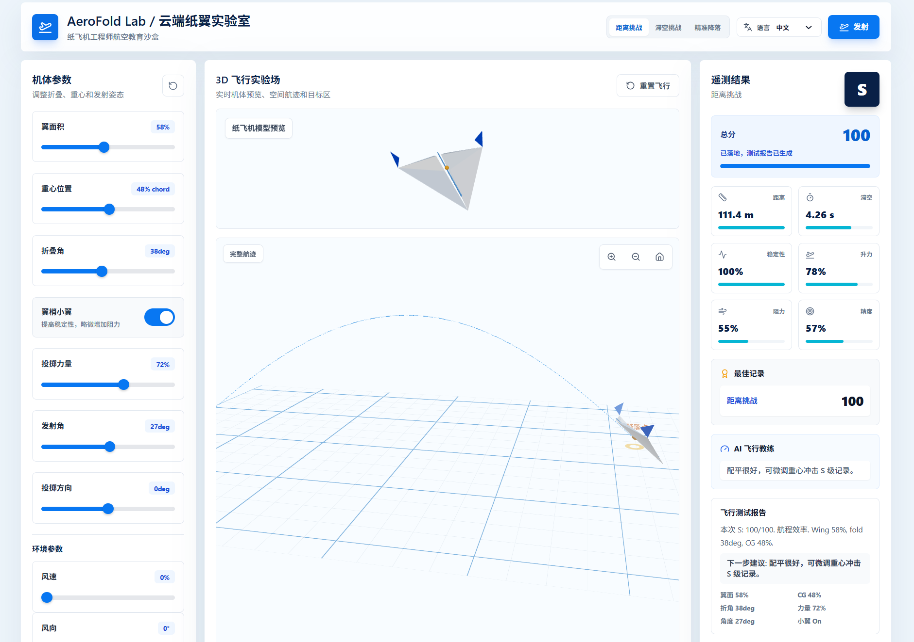
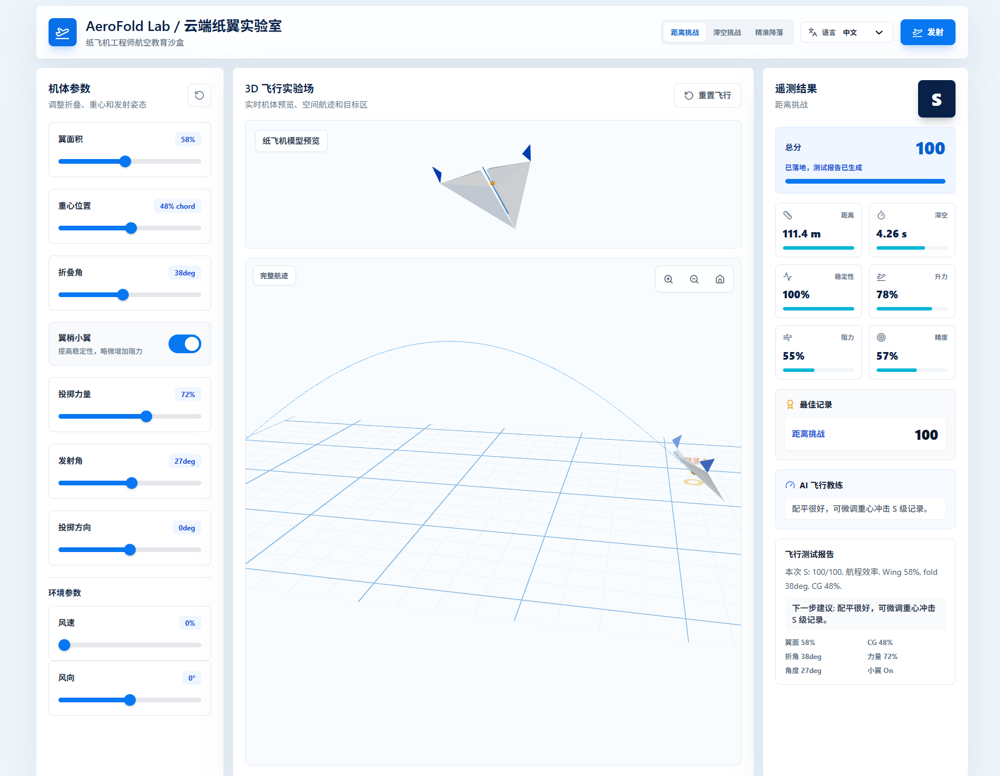
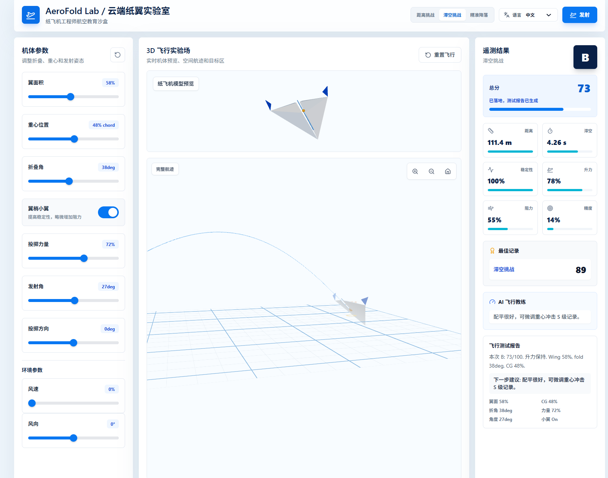

# AeroFold Lab / 云端纸翼实验室

一个面向纸飞机工程探究的 3D 互动实验平台。用户可以调节翼面积、重心、折叠角、投掷力度、发射角、风速与风向，实时观察纸飞机模型、空间航迹和落点表现，并获得评分、最佳记录和 AI 飞行教练建议。



## 项目亮点

- 3D 纸飞机实验场：基于 React Three Fiber 展示纸飞机模型、网格地面、预测航迹和目标区域。
- 多模式挑战：支持距离挑战、滞空挑战、精准降落三种实验目标。
- 参数化飞行模拟：通过翼面积、重心、折叠角、翼梢小翼、投掷力度、发射角、风速和风向影响飞行结果。
- 即时数据反馈：展示距离、滞空时间、稳定性、升力、阻力、精准度、总分和等级。
- AI 飞行教练：根据当前机体参数和飞行结果给出下一步调参建议。
- 中英双语界面：支持中文、英文和双语显示，适合课堂展示与项目路演。
- 本地最佳记录：使用浏览器 localStorage 保存不同挑战模式下的最高分。

## 演示页面

更多截图和场景说明见 [docs/DEMO.md](docs/DEMO.md)。

| 距离挑战 | 滞空挑战 |
| --- | --- |
|  |  |

| 飞行结果与教练建议 |
| --- |
|  |

## 技术栈

- React 18
- TypeScript
- Vite
- Tailwind CSS
- Three.js
- React Three Fiber
- @react-three/drei
- lucide-react

## 本地运行

```bash
npm install
npm run dev
```

默认会启动 Vite 开发服务器。打开终端输出的本地地址即可体验。

## 生产构建

```bash
npm run build
```

构建产物会输出到 `dist/` 目录，可部署到 GitHub Pages、Vercel、Netlify 或其他静态站点托管平台。

## 项目结构

```text
.
+-- docs/
|   +-- DEMO.md
|   +-- images/
+-- src/
|   +-- App.tsx
|   +-- index.css
|   +-- main.tsx
+-- index.html
+-- package.json
+-- tailwind.config.js
+-- vite.config.ts
```

## 核心逻辑

项目将纸飞机实验拆分为机体参数、环境参数、挑战模式和飞行结果四部分。用户每次调整参数后，系统会重新计算升力、阻力、稳定性、失速风险、航程、滞空时间和落点偏差，并根据不同挑战模式生成最终评分。

评分逻辑会随挑战目标变化：

- 距离挑战：更关注航程和稳定性。
- 滞空挑战：更关注滞空时间和稳定性。
- 精准降落：更关注落点误差、稳定性、距离和升力。

## AI 辅助开发说明

本项目开发过程中综合使用了 Trae、Hermes 和 Codex 等 AI 编程工具。AI Agent 主要参与了需求拆解、界面搭建、代码生成、报错排查、交互优化、3D 场景调整和 README 文档整理，帮助项目在有限时间内完成从创意原型到可演示作品的迭代。

## 适用场景

- 信息科技与科学探究课堂演示
- 纸飞机空气动力学入门实验
- 学生创新项目或竞赛作品展示
- 3D Web 交互界面学习案例

## License

本项目用于学习、课程展示与竞赛作品展示。如需二次使用，请保留项目来源说明。
